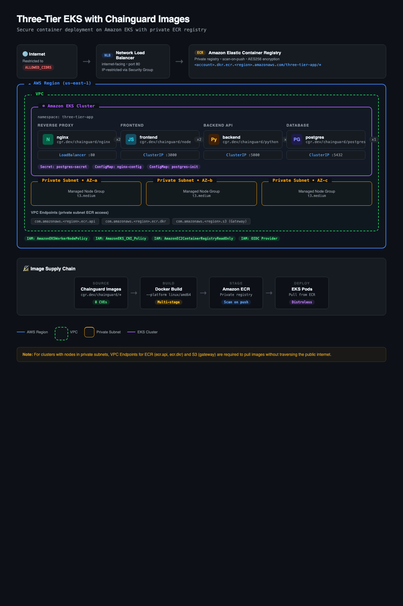

# three-tier-eks

Deploy a three-tier web application to **Amazon EKS** using secure **Chainguard Images** staged through a private **Amazon ECR** registry.

This is the cloud-native companion to [three-tier-sample-app](https://github.com/troy-chainguard-dev/three-tier-sample-app), which demonstrates the same application running locally with Docker Compose. This project takes the next step: operationalizing Chainguard Images in a production-style Kubernetes environment on AWS.

## What You'll Learn

1. **Provision an EKS cluster** using `eksctl` (kicked off first since it takes ~15-20 min)
2. **Create private ECR repositories** to host your container images (while the cluster builds)
3. **Build and push Chainguard-based images** to ECR (the enterprise pattern for staging images through a private registry)
4. **Deploy the three-tier app** to Kubernetes with manifests that pull from your private ECR

## Architecture

<div align="center">
  
</div>

> **Interactive version**: Open [`img/architecture.html`](img/architecture.html) in a browser for a zoomable, hover-enabled version of this diagram.

### Container Images

| Component | Chainguard Base Image | ECR Repository |
|-----------|----------------------|----------------|
| **nginx** (reverse proxy) | `cgr.dev/chainguard/nginx:latest` | `three-tier-app/nginx` |
| **Frontend** (Node.js) | `cgr.dev/chainguard/node:latest` | `three-tier-app/frontend` |
| **Backend** (Python/Flask) | `cgr.dev/chainguard/python:latest` | `three-tier-app/backend` |
| **Database** (PostgreSQL) | `cgr.dev/chainguard/postgres:latest` | `three-tier-app/postgres` |

---

## Prerequisites

- **AWS CLI** configured with credentials (`aws configure`)
- **Docker** (for building and pushing images)
- **eksctl** ([install guide](https://eksctl.io/installation/))
- **kubectl** ([install guide](https://kubernetes.io/docs/tasks/tools/))
- An AWS account with permissions for EKS, ECR, EC2, and IAM

Verify your tools:
```bash
aws sts get-caller-identity
docker --version
eksctl version
kubectl version --client
```

---

## Quick Start

If you're comfortable with the prerequisites above and want to get running fast:

```bash
# 1. Kick off EKS cluster creation first (~15-20 min to provision)
./scripts/01-create-eks-cluster.sh us-east-1

# 2. In a SECOND terminal (while the cluster builds), create ECR repos
./scripts/02-create-ecr-repos.sh us-east-1

# 3. Build Chainguard images and push to ECR (still in second terminal)
./scripts/03-push-chainguard-images-to-ecr.sh us-east-1

# 4. Once the cluster is ready, deploy the app (auto-detects your IP for LB access)
./scripts/04-deploy-app.sh us-east-1

# Or specify allowed IPs explicitly:
# ALLOWED_CIDRS="1.2.3.4/32,5.6.7.8/32" ./scripts/04-deploy-app.sh us-east-1
```

Or follow the detailed walkthrough below.

---

## Step-by-Step Walkthrough

### Step 1: Create the EKS Cluster

> **Already have an EKS cluster?** You can skip this step if your existing cluster meets these requirements:
> - **ECR access**: Nodes must be able to reach ECR. If your nodes are in **private subnets**, you'll need either a NAT gateway or VPC endpoints for `ecr.api`, `ecr.dkr`, and `s3` (gateway type).
> - **IAM permissions**: Node IAM role must include `AmazonEC2ContainerRegistryReadOnly` (or equivalent).
> - **kubeconfig**: Point kubectl at your cluster: `aws eks update-kubeconfig --name <CLUSTER_NAME> --region <REGION>`
>
> Verify connectivity with `kubectl get nodes` before proceeding to **Step 2**.

We kick off the cluster first because it takes **15-20 minutes** to provision. While it builds, we'll set up ECR and push our images in a second terminal.

We use `eksctl` with a declarative cluster configuration file for reproducibility.

```bash
./scripts/01-create-eks-cluster.sh us-east-1
```

**Leave this running** and open a second terminal for the next steps.

The cluster config (`eksctl-cluster.yaml`) creates:
- A Kubernetes 1.31 cluster named `three-tier-demo`
- A managed node group with 2x `t3.medium` instances
- IAM OIDC provider (for future service account integrations)
- Nodes with ECR read-only access (so they can pull from your private registry)

### Step 2: Create ECR Repositories (in a second terminal)

While the cluster provisions, let's set up our private container registry. Amazon ECR is a fully managed container registry. We'll create a private repository for each component of our application. This mirrors the real-world pattern where organizations stage approved images in their own registry rather than pulling directly from public sources.

```bash
./scripts/02-create-ecr-repos.sh us-east-1
```

**What this does:**
- Creates four ECR repositories under the `three-tier-app/` prefix
- Enables scan-on-push so ECR automatically scans images for vulnerabilities
- Uses AES256 encryption at rest

You can verify the repositories were created:
```bash
aws ecr describe-repositories --query 'repositories[?starts_with(repositoryName, `three-tier-app`)].repositoryName' --output table
```

Expected output:
```
-----------------------------------
|      DescribeRepositories       |
+---------------------------------+
|  three-tier-app/nginx           |
|  three-tier-app/frontend        |
|  three-tier-app/backend         |
|  three-tier-app/postgres        |
+---------------------------------+
```

### Step 3: Build and Push Chainguard Images to ECR

This is the key step that demonstrates the enterprise image supply chain. We:
1. Pull free Chainguard base images from `cgr.dev/chainguard/`
2. Build our application images using multi-stage Dockerfiles
3. Push the final images to our private ECR registry

```bash
./scripts/03-push-chainguard-images-to-ecr.sh us-east-1
```

**What this does:**
- Authenticates Docker to your ECR registry
- Builds each component for `linux/amd64` using Chainguard base images (see `app/*/Dockerfile`)
- Tags and pushes to your private ECR

> **Note on platform**: The script builds for `linux/amd64` since EKS nodes typically run on x86_64 instances. If you're building on an Apple Silicon Mac, Docker will cross-compile automatically via QEMU emulation.

**Why stage through ECR?**
- **Air-gap readiness**: Your cluster only needs access to ECR, not the public internet
- **Compliance**: All images come from a controlled, auditable source
- **Reliability**: No dependency on external registries at deploy time
- **Scanning**: ECR can scan images on push and block deployments of vulnerable images
- **IAM integration**: Fine-grained access control via AWS IAM policies

#### Understanding the Dockerfiles

Each Dockerfile uses Chainguard's multi-stage build pattern. Here's the backend as an example:

```dockerfile
# Stage 1: Build with the -dev variant (includes pip, shell)
FROM cgr.dev/chainguard/python:latest-dev AS builder
WORKDIR /app
COPY requirements.txt .
RUN python -m venv /app/venv && \
    /app/venv/bin/pip install --no-cache-dir -r requirements.txt

# Stage 2: Copy into the distroless runtime (no shell, no package manager)
FROM cgr.dev/chainguard/python:latest
WORKDIR /app
ENV PYTHONUNBUFFERED=1
ENV PATH="/venv/bin:$PATH"
COPY . .
COPY --from=builder /app/venv /venv
ENTRYPOINT [ "python", "wsgi.py" ]
```

The `-dev` variant includes build tools (pip, shell, etc.) for the build stage. The production runtime image is **distroless** — no shell, no package manager, minimal attack surface.

### Step 4: Verify the Cluster is Ready

By now the EKS cluster should be finished provisioning. Switch back to your first terminal and confirm it completed successfully, then verify connectivity:

```bash
kubectl get nodes
```

Expected output:
```
NAME                             STATUS   ROLES    AGE   VERSION
ip-192-168-xx-xx.ec2.internal   Ready    <none>   2m    v1.31.x
ip-192-168-xx-xx.ec2.internal   Ready    <none>   2m    v1.31.x
```

### Step 5: Deploy the Application

Deploy all Kubernetes resources (namespace, secrets, deployments, services):

```bash
./scripts/04-deploy-app.sh us-east-1
```

By default, the script **auto-detects your public IP** and restricts the LoadBalancer to only accept traffic from that IP. To allow additional IPs (e.g., teammates or a demo audience), pass them as a comma-separated list:

```bash
ALLOWED_CIDRS="1.2.3.4/32,5.6.7.8/32" ./scripts/04-deploy-app.sh us-east-1
```

**What this does:**
- Creates the `three-tier-app` namespace
- Substitutes your ECR registry URI and allowed CIDRs into the manifests
- Deploys PostgreSQL with ephemeral storage (`emptyDir`)
- Deploys the backend (Flask) and frontend (Node.js) with health checks
- Deploys nginx as a reverse proxy behind an AWS Network Load Balancer (IP-restricted)
- Waits for all deployments to become ready

#### Verify the Deployment

Check that all pods are running:
```bash
kubectl -n three-tier-app get pods
```

Expected output:
```
NAME                        READY   STATUS    RESTARTS   AGE
backend-xxxxxxxxxx-xxxxx    1/1     Running   0          60s
backend-xxxxxxxxxx-xxxxx    1/1     Running   0          60s
frontend-xxxxxxxxxx-xxxxx   1/1     Running   0          60s
frontend-xxxxxxxxxx-xxxxx   1/1     Running   0          60s
nginx-xxxxxxxxxx-xxxxx      1/1     Running   0          60s
nginx-xxxxxxxxxx-xxxxx      1/1     Running   0          60s
postgres-xxxxxxxxxx-xxxxx   1/1     Running   0          60s
```

Get the load balancer URL:
```bash
kubectl -n three-tier-app get svc nginx -o jsonpath='{.status.loadBalancer.ingress[0].hostname}'
```

Open the URL in your browser (DNS propagation may take a few minutes). You should see the Course Registration page, just like the local Docker Compose version.

### Step 6: Explore and Verify

View logs across all components:
```bash
kubectl -n three-tier-app logs -l app=nginx --tail=20
kubectl -n three-tier-app logs -l app=backend --tail=20
kubectl -n three-tier-app logs -l app=frontend --tail=20
kubectl -n three-tier-app logs -l app=postgres --tail=20
```

Check the images running in your pods (confirm they're from ECR):
```bash
kubectl -n three-tier-app get pods -o jsonpath='{range .items[*]}{.metadata.name}{"\t"}{.spec.containers[0].image}{"\n"}{end}'
```

---

## Cleanup

Remove the app from the cluster:
```bash
./scripts/05-cleanup.sh us-east-1
```

Delete the app AND the EKS cluster:
```bash
./scripts/05-cleanup.sh us-east-1 --delete-cluster
```

Delete everything (app + cluster + ECR repos):
```bash
./scripts/05-cleanup.sh us-east-1 --delete-all
```

---

## Project Structure

```
three-tier-eks/
├── README.md                     # This file
├── eksctl-cluster.yaml           # EKS cluster configuration
├── app/                          # Application source code and Dockerfiles
│   ├── frontend/                 # Node.js frontend
│   │   ├── Dockerfile
│   │   ├── package.json
│   │   ├── src/server.js
│   │   └── public/
│   │       ├── index.html
│   │       └── index.js
│   ├── backend/                  # Python/Flask backend
│   │   ├── Dockerfile
│   │   ├── requirements.txt
│   │   ├── wsgi.py
│   │   └── app/
│   │       ├── __init__.py
│   │       ├── routes.py
│   │       └── models.py
│   ├── db/                       # PostgreSQL init
│   │   ├── Dockerfile
│   │   └── init.sql
│   └── nginx/                    # nginx reverse proxy
│       ├── Dockerfile
│       └── nginx.conf
├── k8s/                          # Kubernetes manifests
│   ├── namespace.yaml
│   ├── postgres.yaml             # Secret + ConfigMap + Deployment + Service
│   ├── backend.yaml              # Deployment + Service
│   ├── frontend.yaml             # Deployment + Service
│   └── nginx.yaml                # ConfigMap + Deployment + LoadBalancer Service
└── scripts/                      # Automation scripts (run in order)
    ├── 01-create-eks-cluster.sh
    ├── 02-create-ecr-repos.sh
    ├── 03-push-chainguard-images-to-ecr.sh
    ├── 04-deploy-app.sh
    └── 05-cleanup.sh
```

## Key Differences from the Docker Compose Version

| Aspect | three-tier-sample-app | three-tier-eks |
|--------|----------------------|----------------|
| **Runtime** | Docker Compose (local) | Amazon EKS (cloud) |
| **Registry** | Local Docker images | Private ECR |
| **Networking** | Docker bridge network | Kubernetes Services + NLB |
| **Storage** | Docker volumes | `emptyDir` (swap to PVC with EBS CSI driver for production) |
| **Scaling** | Single container per service | Replica sets (2 replicas for frontend/backend/nginx) |
| **Health checks** | None | Readiness + liveness probes |
| **Service discovery** | Docker DNS (`backend:5000`) | Kubernetes DNS (`backend.three-tier-app.svc`) |
| **Load balancing** | nginx container | AWS NLB + nginx pods |
| **DB credentials** | docker-compose env vars | Kubernetes Secrets |

---

## Cost Estimate

Running this demo will incur AWS charges. Approximate costs for `us-east-1`:

| Resource | Estimated Cost |
|----------|---------------|
| EKS control plane | ~$0.10/hr |
| 2x t3.medium nodes | ~$0.08/hr (total) |
| Network Load Balancer | ~$0.02/hr |
| ECR storage | negligible |
| **Total** | **~$0.20/hr (~$4.80/day)** |

**Remember to run the cleanup script when you're done!**

---

## Further Reading

- [Chainguard Images Directory](https://images.chainguard.dev/) — Explore all available Chainguard images
- [Chainguard Academy](https://edu.chainguard.dev/) — Free courses on container security
- [three-tier-sample-app](https://github.com/troy-chainguard-dev/three-tier-sample-app) — The local Docker Compose version of this project
- [Amazon EKS Documentation](https://docs.aws.amazon.com/eks/latest/userguide/)
- [Amazon ECR Documentation](https://docs.aws.amazon.com/AmazonECR/latest/userguide/)
- [eksctl Documentation](https://eksctl.io/)
